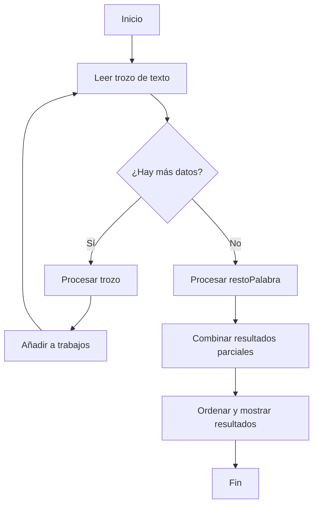

# Proyecto de Programación Concurrente y Paralela: Conteo de Palabras

## Miembros del equipo
- Camila Atehortua Duarte (carnet: c20857)

## Cómo compilar el proyecto
Para compilar el proyecto, ejecuta el siguiente comando:
```bash
g++ -o contador contador_palabras.cpp
```

## Cómo correr el proyecto
Para correr el proyecto y contar las palabras en un archivo grande, puedes usar:
```bash
./contador < archivo_grande.txt
```

Para probar el programa con `wordcount.go`, puedes usar:
```bash
go run wordcount.go -mode generator -seed 1234 -words 10000 -size 100000000 | ./contador | go run wordcount.go -mode validator -seed 1234 -words 10000 -size 100000000
```

## Diseño de su programa
### Descripción
El programa está diseñado para leer un texto desde la entrada estándar, contar la cantidad de veces que aparece cada palabra en el texto y retornar una lista de palabras ordenadas alfabéticamente junto con su cantidad total.

### Diagrama de flujo (Mermaid)


### Explicación
1. **Lectura del archivo**: El programa lee trozos del archivo de entrada estándar en partes de 10 MB.
2. **Procesamiento de palabras**: Cada trozo de texto es procesado para contar la cantidad de veces que aparece cada palabra.
3. **Manejo de palabras partidas**: Si una palabra está partida entre dos trozos, se maneja concatenando el resto de la palabra al siguiente trozo.
4. **Uso de hilos**: Se utilizan varios hilos para procesar trozos de texto en paralelo, aumentando la eficiencia del programa.
5. **Combinar resultados**: Los resultados parciales de cada hilo se combinan en un conteo global.
6. **Ordenar y mostrar**: La lista final de palabras se ordena alfabéticamente y se muestra en la salida estándar.

## Problemas encontrados
- Inicialmente, el programa tenía problemas con palabras partidas y la gestión de memoria.
- Estos problemas se resolvieron ajustando la lógica de manejo de palabras y utilizando `valgrind` para detectar fugas de memoria.

## ¿Qué funciona y qué no funciona?
### Funciona
- Conteo correcto de palabras en textos grandes.
- Uso eficiente de hilos para procesamiento paralelo.
- Manejo adecuado de palabras partidas entre trozos.
- No hay fugas de memoria según `valgrind`.

### No funciona
- No se encontraron problemas significativos en la última versión del código.

```